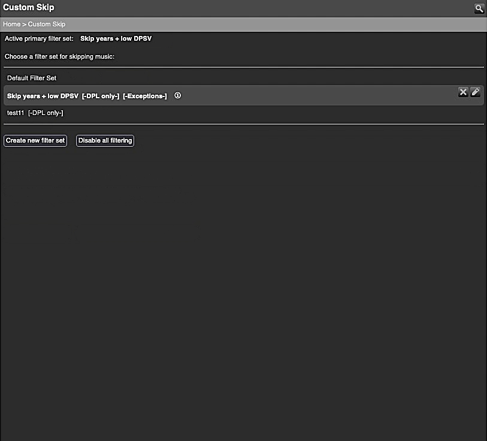

Custom Skip
====

**Custom Skip**[^1] lets you player-specific **rules** for when the current track or upcoming tracks in your playlist should be skipped and removed from the playlist **automatically**. 
Some preferences are not enabled by default.
  
[⬅️ **Back to the list of all plugins**](https://github.com/AF-1/)
  

## Requirements

- LMS version >= **8**.0
- LMS database = **SQLite**
   

## Features:

* Comes with 30+ ready-to-use skip/filter rules.

* **Look-ahead filtering**: Have <i>Custom Skip</i> check not only the current song, but also the following songs to see if they have to be skipped/removed from the playlist. Helps avoiding short but unpleasant playback interruptions when a current song is skipped. Not enabled by default.

* Use the context menu to (temporarily) filter </i>artists</i>, <i>albums</i>, <i>genres</i>, <i>years</i>, <i>tracks</i> or <i>playlists</i>.

* Should work with **online library tracks** (see [**FAQ**](https://github.com/AF-1/lms-customskip#faq)).

* Clear and informative user interface.

   

## Screenshots[^2]

   

## Installation

⚠️ **Please read the [FAQ](https://github.com/AF-1/lms-customskip#faq) *before* installing this plugin.** 

You should be able to install **Custom Skip** from the LMS main repository (LMS plugin library): **LMS > Settings > Plugins**. 

If you want to test a new patch that hasn't made it into a release version yet, you'll have to [install the plugin manually](https://github.com/AF-1/sobras/wiki/Manual-installation-of-LMS-plugins).

It usually takes a few hours for a *new* release to be listed on the LMS plugin page.
   

## Reporting a new issue

If you want to report a new issue, please fill out this [**issue report template**](https://github.com/AF-1/lms-customskip/issues/new?template=bug_report.md&title=%5BISSUE%5D+).
    

## FAQ

»<b>I can't find my filter <i>sets</i>.</b>«
 

</i>Custom Skip</i> automatically creates a folder called <b>CustomSkip3</b> at a location that you can set in the CustomSkip settings. The default location is the <b>LMS preferences folder</b>. Grouping CustomSkip filter set files in a dedicated subfolder helps reduce clutter. Just move your old filter set files (file extension <b>.cs.xml</b>) into the new subfolder. You can also move the CustomSkip3 folder out of the LMS preferences folder to any other location (with the necessary file permissions for LMS).

 

»<b>How can I make Custom Skip filter only dynamic playlist tracks?</b>«
 

Explained in the <a href="https://github.com/AF-1/lms-customskip/wiki#i-want-customskip-to-filter-only-dynamic-playlist-tracks">wiki</a>.

 

»<b>What's the difference between a <i>primary</i> and a <i>secondary</i> filter set?</b>«
 

Explained in the <a href="https://github.com/AF-1/lms-customskip/wiki#primary-and-secondary-filter-sets">wiki</a>.

 

»<b>Can I call Custom Skip from the <i>context</i> menu?</b>«
 

</i>Artists</i>, <i>albums</i>, <i>genres</i>, <i>years</i>, <i>tracks</i> and <i>playlists</i> have a CustomSkip content menu that lets you add a filter/skip rule to the <b>active primary</b> filter set. Example: you want to skip all tracks of the selected artist for the next 15 minutes.

 

»<b>I <i>can't save</i> new Custom Skip filter rules/sets. I get this error message: “Could not create the <i>CustomSkip3</i> folder“.</i></b>«
 

The <i>CustomSkip3</i> folder is where CS stores your filter set files. On every LMS (re)start, CS checks if there's a folder called <i>CustomSkip3</i> in the parent folder. The default <b>parent</b> folder is the <i>LMS preferences folder</i> but you can change that in CustomSkip3's preferences. If it doesn't find the folder <i>CustomSkip3</i> inside the specified parent folder, it will try to create it.  
The most likely cause for the error message above and matching error messages in the server log is that CS can't create the folder because LMS doesn't have read/write permissions for the parent folder (or the <i>CustomSkip3</i> folder).  
So please make sure that <b>LMS has read/write permissions (755) for the parent folder - and the <i>CustomSkip3</i> folder</b> (if it exists but cannot be accessed).

 

»<b>Does Custom Skip handle online tracks?</b>«
 

Custom Skip will process <b>online tracks</b> that have been <b>added to your LMS library as part of an album</b>. LMS does not import <b>single</b> online tracks or tracks of <i>online</i> <b>playlists</b> as <b>library</b> tracks and therefore they won't be processed by Custom Skip.

 

»<b>The web menu doesn't have a filter rule for skipping single tracks. How can I skip <i>single</i> tracks?</b>«
 

You can create a skip rule for single tracks from a track's context menu.

 

»<b>Look-ahead filtering doesn't delete all tracks that should be filtered but always leaves one in the playlist.</b>«
 

Custom Skip's look-ahead filtering will leave at least one last track in the playlist after the currently playing track to avoid problems with plugins that use song change events to trigger actions.

 

»<b>Is Custom Skip v3 compatible with Dynamic Playlists v2?</b>«
 

</i>Custom Skip v</b>3</b></i> works with <i>Dynamic Playlists</i> version <b>4</b>. Anything else is untested and unsupported.

 

»<b>Why are the filter rules '<i>recently played track/artist/album</i>' only available for look-ahead filtering?</b>«
 

As soon as a new song starts playing LMS will set its <i>last time played</i> to the <i>current</i> time and <b>then</b> notify other plugins like Custom Skip of the song change event. So Custom Skip's filtering doesn't kick in until <b>after</b> the <i>last time played</i> has been set to the <i>current</i> time. Therefore if Custom Skip checked currently playing tracks against a <i>recently played</i> filter rule it would find that <i>all</i> currently playing tracks have been recently played and skip them resulting in endless skipping. That's why these rules are only available for look-ahead filtering.

 

    
[^1]: If you want localized strings in your language, please read <a href="https://github.com/AF-1/sobras/wiki/Adding-localization-to-LMS-plugins"><b>this</b></a>.
[^2]: The screenshots might not correspond to the UI of the latest release in every detail.
